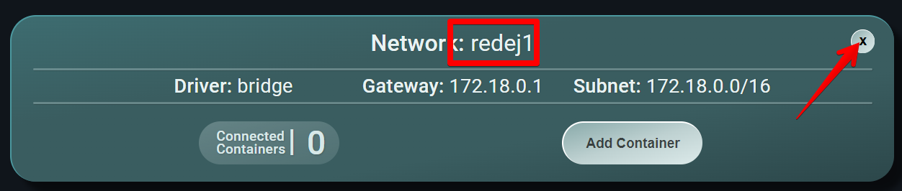

<div style="text-align: center;">
    <h1>Actividad Evaluable 3</h1>
    <h2>Docker</h2>
    <h3>Ejercicio 1 - Contenedores en red y Docker Desktop</h3>
    <h3>Despliegue de Aplicaciones Web - DAW Distancia<br>
    CIFP Sect. Industrial y Servicios - La Laboral<br>
    Curso 2024-2025<br>
    01 de abril de 2025<br>
    Emilio Zaera Vidal - 46.911.234-C</h3>
</div>


<div style="page-break-after: always;"></div>
> Autor: **Emilio Zaera Vidal** 
>
> fecha: 01 del 04 de 2025
[TOC]

## 1. Introducción

En el módulo de **Despliegue de Aplicaciones Web**, uno de los objetivos fundamentales es aprender a gestionar entornos de despliegue modernos utilizando tecnologías basadas en contenedores. En este contexto, la herramienta **Docker** se ha convertido en un estándar para la creación, configuración y administración de entornos aislados, facilitando el despliegue y la distribución de aplicaciones web.

La presente tarea evaluable tiene como finalidad reforzar los conocimientos adquiridos sobre Docker mediante la realización de tres ejercicios prácticos. A través de estos ejercicios, se trabajará la creación de contenedores en red, la orquestación de servicios y la construcción de una imagen personalizada. Todo ello permitirá al alumno familiarizarse con el ciclo completo de creación, despliegue y gestión de contenedores, así como con las buenas prácticas de documentación y organización de proyectos en un repositorio.

> La **orquestación de servicios** es el proceso de coordinar y gestionar varios contenedores para que funcionen juntos como una única aplicación. En Docker, se realiza con herramientas como **Docker Compose**, que permiten definir y automatizar la configuración y despliegue de todos los servicios desde un solo archivo.

---

---


## 2. Metodología

La metodología propuesta para esta tarea consiste en la resolución práctica de tres ejercicios diferenciados. En cada uno de ellos, se deberá crear un entorno utilizando distintas herramientas de Docker: redes y contenedores mediante Docker Desktop, despliegue con Docker Compose y creación de una imagen personalizada con Dockerfile. Todo el trabajo se documentará y organizará en un repositorio público de GitHub, utilizando ramas para cada ejercicio. Además, como parte de la evaluación, se solicita un videoclip donde el estudiante muestre y explique parte del trabajo realizado.

---

---


## 3. Preparativos

### Creación de un nuevo repositorio `tareaDocker`

Creo un nuevo repositorio público en [mi GitHub](https://github.com/emiliozv/tareaDocker) para la tarea:


### Clonado y vinculación en local

Trabajaré en local para, al finalizar, subir todo al repositorio remoto en GitHub. Para ello, creo un repositorio local mediante la línea de comandos de git, genero las carpetas y los ficheros `.md`, y lo vinculo con el remoto:


### Creación de las ramas

Creo las 3 ramas y cambio a ellas cuando lo necesite. Ejemplo con rama `ejercicio1`:

```bash
git branch ejercicio1
git switch ejercicio1
```

---

---


## 4. Ejercicio 1 - Contenedores en red y Docker Desktop

### Creación red bridge `redej1`

Este ejercicio se realiza desde Docker Desktop

> En Docker Desktop instalamos previamente la extensión `PortNavigator`


---


### Creación contenedor de `mariadb`

Primero busco la imagen oficial de `mariadb` en el buscador de Docker Desktop y la descargo pulsando sobre el botón `Pull`:


A continuación creo el contenedor pulsando sobre `Run`:


Podemos ver esta ventana de ajustes opcionales, donde introduciremos la información solicitada en el enunciado:


Para ello tendremos que encontrar en la documentación de la imagen la información necesaria:

- Definición de contraseña para el usuario root:

  

  El nombre de la variable de entorno es `MARIADB_ROOT_PASSWORD`, para el valor (la contraseña) estableceré "root".

  

- Definir un usuario con mi nombre de pila y con contraseña:

  https://mariadb.com/kb/en/mariadb-server-docker-official-image-environment-variables/

  

  - Nombre de usuario: El nombre de la variable de entorno es `MARIADB_USER`. Su valor será "Emilio"

  - Contraseña: El nombre de la variable de entorno es `MARIADB_PASSWORD`. Su valor será "1234"

    

- Nombre de la BD por defecto será `DAW`:

  

  - Nombre de la BD: El nombre de la variable de entorno es `MARIADB_DATABASE`. Su valor será "DAW"


Con la información anterior, queda de la siguiente manera:


#### Script creación de tabla `modulos`

```sql
CREATE TABLE modulos (
    id INT AUTO_INCREMENT PRIMARY KEY,
    nombre VARCHAR(50) NOT NULL
);

INSERT INTO modulos (nombre) VALUES
('cliente'),
('servidor'),
('interfaces'),
('despliegue'),
('empresa'),
('proyecto'),
('prácticas');
```

---


### Creación de contenedor con `Adminer`

Introduzco "adminer" en el buscador de Docker Desktop y hago un `Pull` de la imagen, para luego crear el contenedor meidante `Run`:


---


### Conexión de los contenedores a la red `redej1`

Primero desconecto de la red bridge por defecto (muestro `mariadb_ej1`):


A continuación, conecto ambos contenedores a la red `redej1` (muestro `adminer_ej1`):


Resultado de la configuración de red:


Compruebo mediante ping la conexión de adminer con mariadb:


---


### Conexión a la BD con Adminer

```url
http://localhost:8088
```


---


### Ejecución del script SQL desde la GUI de Adminer

Creación de la tabla `modulos` mediante el script (SQL command):


Muestra de los datos contenidos en la tabla (SELECT modulos):


---


### Instalación de Disk Usage

Lo busco en el buscador de Docker Desktop y filtro por extensiones:


Muestro el espacio ocupado:


Borro el contenedor `mariadb_ej1` y compruebo la diferencia:


---


### Borro los contenedores y la red


Resultado, ningún contenedor:


Borrado de la red `redej1`:



