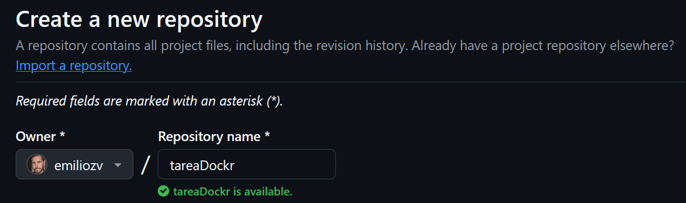
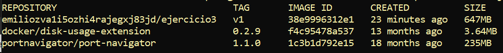

<div style="text-align: center;">
    <h1>Actividad Evaluable 3</h1>
    <h2>Docker</h2>
    <h3>Ejercicio 3 - imagen con Dockerfile - Aplicación web</h3>
    <h3>Despliegue de Aplicaciones Web - DAW Distancia<br>
    CIFP Sect. Industrial y Servicios - La Laboral<br>
    Curso 2024-2025<br>
    01 de abril de 2025<br>
    Emilio Zaera Vidal - 46.911.234-C</h3>
</div>


<div style="page-break-after: always;"></div>
> Autor: **Emilio Zaera Vidal** 
>
> fecha: 01 del 04 de 2025
[TOC]

## 1. Introducción

En el módulo de **Despliegue de Aplicaciones Web**, uno de los objetivos fundamentales es aprender a gestionar entornos de despliegue modernos utilizando tecnologías basadas en contenedores. En este contexto, la herramienta **Docker** se ha convertido en un estándar para la creación, configuración y administración de entornos aislados, facilitando el despliegue y la distribución de aplicaciones web.

La presente tarea evaluable tiene como finalidad reforzar los conocimientos adquiridos sobre Docker mediante la realización de tres ejercicios prácticos. A través de estos ejercicios, se trabajará la creación de contenedores en red, la orquestación de servicios y la construcción de una imagen personalizada. Todo ello permitirá al alumno familiarizarse con el ciclo completo de creación, despliegue y gestión de contenedores, así como con las buenas prácticas de documentación y organización de proyectos en un repositorio.

> La **orquestación de servicios** es el proceso de coordinar y gestionar varios contenedores para que funcionen juntos como una única aplicación. En Docker, se realiza con herramientas como **Docker Compose**, que permiten definir y automatizar la configuración y despliegue de todos los servicios desde un solo archivo.


## 2. Metodología

La metodología propuesta para esta tarea consiste en la resolución práctica de tres ejercicios diferenciados. En cada uno de ellos, se deberá crear un entorno utilizando distintas herramientas de Docker: redes y contenedores mediante Docker Desktop, despliegue con Docker Compose y creación de una imagen personalizada con Dockerfile. Todo el trabajo se documentará y organizará en un repositorio público de GitHub, utilizando ramas para cada ejercicio. Además, como parte de la evaluación, se solicita un videoclip donde el estudiante muestre y explique parte del trabajo realizado.

---

---


## 3. Preparativos

### Creación de un nuevo repositorio `tareaDocker`

Creo un nuevo repositorio público en [mi GitHub](https://github.com/emiliozv/tareaDocker) para la tarea:




### Clonado y vinculación en local

Trabajaré en local para, al finalizar, subir todo al repositorio remoto en GitHub. Para ello, creo un repositorio local mediante la línea de comandos de git, genero las carpetas y los ficheros `.md`, y lo vinculo con el remoto:


### Creación de las ramas

Creo las 3 ramas y cambio a ellas cuando lo necesite. Ejemplo con rama `ejercicio1`:

```bash
git branch ejercicio1
git switch ejercicio1
```

 

## 4. Ejercicio 3 - imagen con Dockerfile - Aplicación web

#### Creación de los ficheros `html`, `css` y `php`

> Los colocamos en el directorio `./web`


---


#### Creación del `Dockerfile`

> Estará en el directorio raíz (`.`)

```dockerfile
FROM php:7.4-apache
COPY ./web/ /var/www/html/
RUN chown -R www-data:www-data /var/www/html && chmod -R 755 /var/www/html
```

En él estamos indicando que:

- la imagen base será la `php:7.4-apache`
- copiará los ficheros del directorio `web` del host (`./web`) en la raíz de documentos del contenedor `/var/www/html/`
- modificará la propiedad y permisos de la raíz de documentos

---


#### Creación de la imagen automatizada

```bash
docker build -t emiliozvA1I5OZhI4RAjEGXj83JD/ejercicio3:v1 .
```

| Parte del comando                              | Significado                                                  |
| ---------------------------------------------- | ------------------------------------------------------------ |
| **docker build**                               | Es el comando para **crear (construir) una imagen** Docker a partir de un Dockerfile. |
| **-t**                                         | Es la opción **tag** (etiqueta). Sirve para darle un nombre a la imagen que estamos creando. |
| **emiliozvA1I5OZhI4RAjEGXj83JD/ejercicio3:v1** | Es el **nombre completo** de la imagen: - `emiliozvA1I5OZhI4RAjEGXj83JD` → es mi usuario en Docker Hub. - `/ejercicio3` → es el **nombre de la imagen**. - `:v1` → es la **versión o etiqueta** de la imagen. |
| **.**                                          | Es la **ruta donde está el Dockerfile** y los archivos necesarios para construir la imagen. El punto significa "la carpeta actual". |


---


En la captura anterior se puede ver la creación de la imagen personalizada y cómo aparece en las imágenes locales, ocupando 647MB.

---


#### Comprobación: Creación de un contenedor de prueba:

Primero lo creamos:

```bash
docker run -d -p 8000:80 emiliozvA1I5OZhI4RAjEGXj83JD/ejercicio3:v1
```

A continuación comprobamos en el navegador su funcionamiento:


---


#### Subida a DockerHub

Para empezar, subo a DockerHub la imagen personalizada. Primero hago un login y luego un push:

```bash
docker login
docker push emiliozva1i5ozhi4rajegxj83jd/ejercicio3:v1
```


A continuación eliminamos la imagen local:

```bash
docker rmi emiliozva1i5ozhi4rajegxj83jd/ejercicio3:v1
```


Compruebo las imágenes actuales:

```bash
docker images
```


---


#### Bajo de mi cuenta (pull) la imagen

```bash
docker pull emiliozva1i5ozhi4rajegxj83jd/ejercicio3:v1
```


```bash
docker images	
```



---


#### Ejecuto un contenedor a partir de esta imagen

```bash
docker run -d -p 1234:80 emiliozva1i5ozhi4rajegxj83jd/ejercicio3:v1
```


